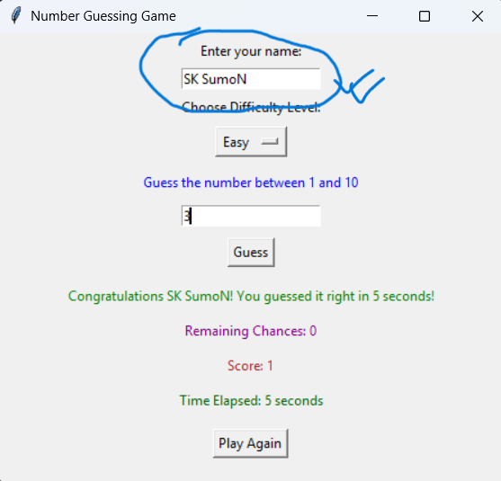
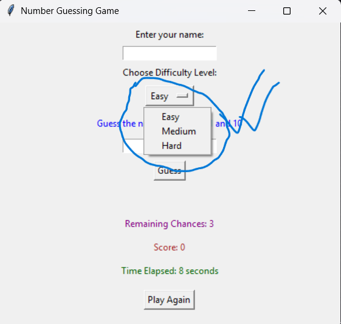
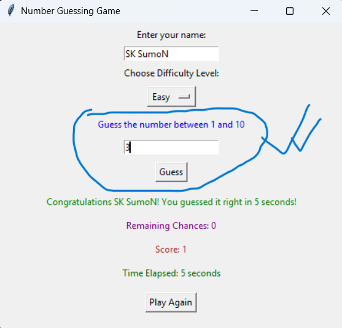
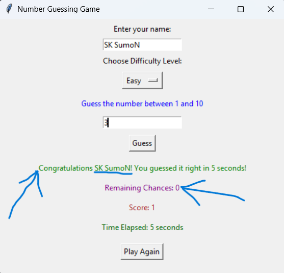
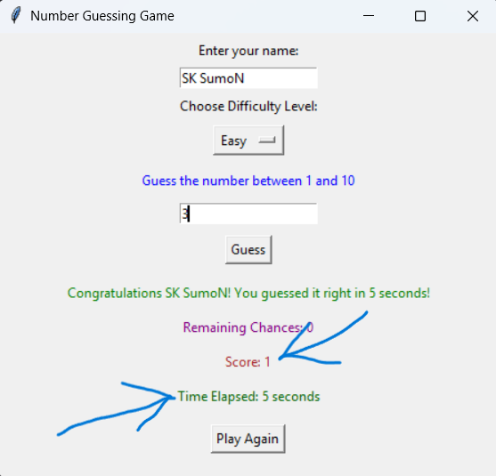

# 🎮 Number Guessing Game (GUI Version)

A fun number guessing game built with Python and Tkinter!  
Guess the randomly generated number within a limited number of attempts. Features level selection, scoring, timer, and player name input!

---

## 🧠 Features

- 🧑 Player Name Input
- 🎯 3 Difficulty Levels:
  - **Easy** → Range: 1–10, Attempts: 3
  - **Medium** → Range: 1–50, Attempts: 3
  - **Hard** → Range: 1–100, Attempts: 5
- ⏱️ Live Timer — see how fast you guess
- 🏆 Score Counter
- 🔁 Play Again Button
- 💥 "You lost!" message if you run out of chances

---

## 🖼️ GUI Preview (Step by Step)

> The game has a clean, interactive user interface.

---

### 👤 Name Input Box



---

### 🎚️ Difficulty Level Dropdown



---

### 🔢 Number Guess Input Field



---

### 📊 Result & Remaining Chances Display



---

### ⏱️ Timer and Score Display




---

## 🚀 How to Run

### 1. Clone or Download

```bash
git clone https://github.com/your-username/number-guessing-game.git
cd number-guessing-game
